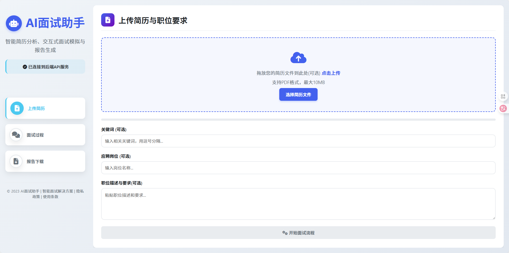
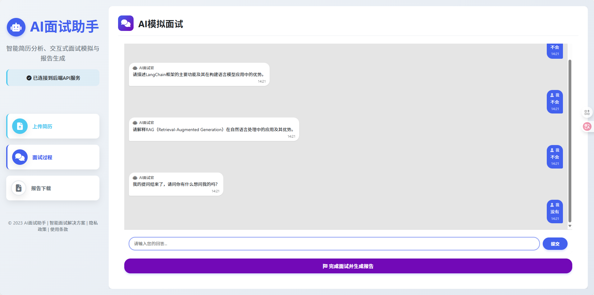
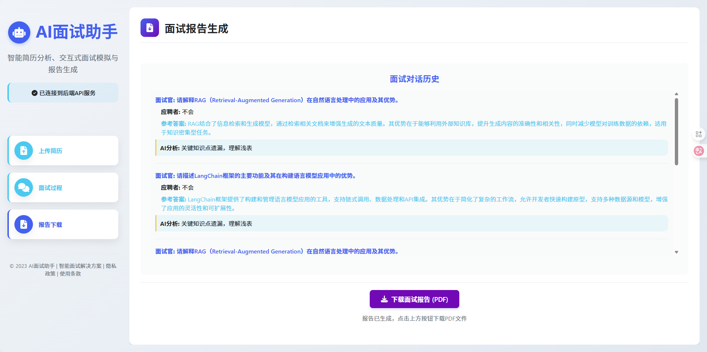

🤖 AI 面试官 - 下一代智能面试官系统

首个支持全流程技术面试的开源AI系统 | Fast API设计 | llm行为分析

🌟 为什么选择AI 面试官？
开发者痛点
😰 技术面试缺乏真实场景练习
📚 传统刷题无法培养沟通表达能力
⏳ 人工模拟面试成本高昂
我们的优势
✅ 轻量级架构 - Fast API，易于集成
✅ 深度技术评估 - LLM评审双引擎
✅ 多模态分析 - 未来（语音/代码/表情多维度评估）

🚀 核心功能速览
智能问答引擎	GPT-4技术概念考察
语音交互系统	Fast API + 异步任务队列

🛠️ 核心技术栈
智能引擎: LangChain + OpenAI

数据库: 未来（Redis）







⚡ 快速开始
5分钟开启你的第一次AI面试：
```
# 1. 克隆仓库
git@github.com:wangllinzhong/AI_Interview.git

# 2. 配置.env文件
下载文件后需要在项目目录下创建.env文件
在其中配置你的OPENAI_API_KEY和OPENAI_API_BASE

# 3. linux下运行docker
如果你是root用户，直接运行以下命令
docker volume create ai-intreview-data
docker build -t ai-interview .
docker run -p 8080:8080 -v ai-intreview-data:/AI-Interview/backend/static ai-interview
# 如果是普通用户，需要先创建docker组，将用户添加到docker组中
sudo groupadd docker
sudo usermod -aG docker $USER
# 然后重新登录，运行以下命令
docker volume create ai-intreview-data
docker build -t ai-interview .
docker run -v root -p 8080:8080 -v ai-intreview-data:/AI-Interview/backend/static ai-interview

# 4. 访问http://localhost:8080
```